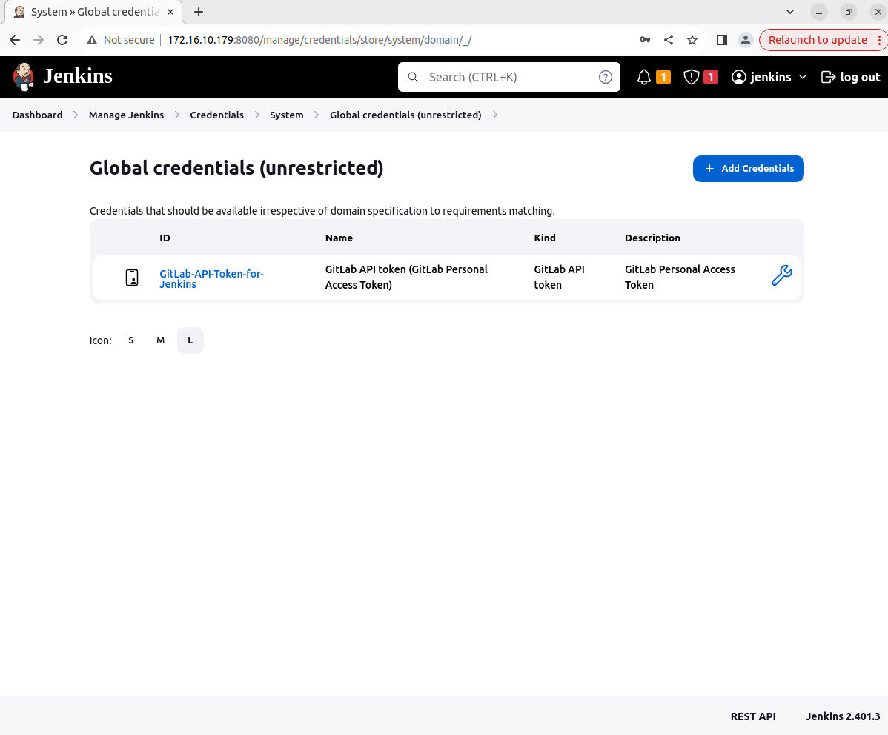
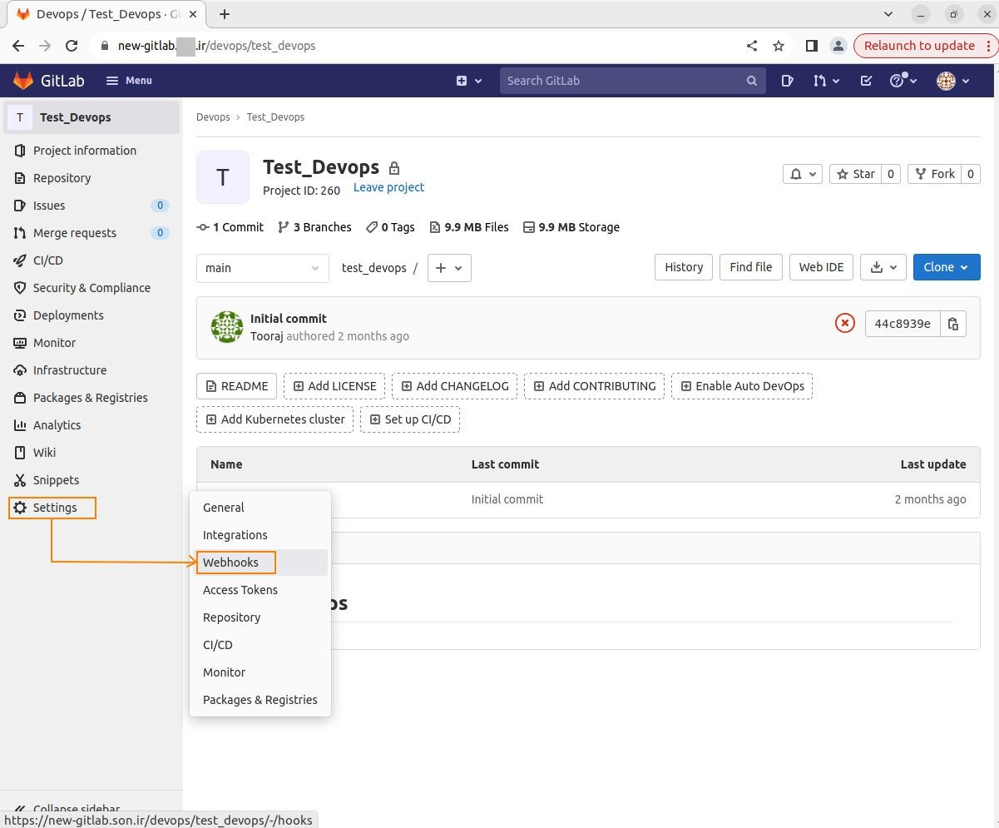
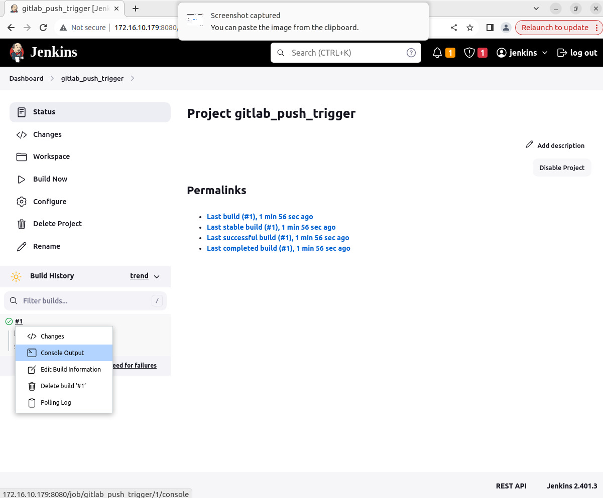

# How to integrate Jenkins with GitLab

The Jenkins integration requires configuration in both GitLab and Jenkins.

1. [Grant Jenkins access to the GitLab project](#grant-jenkins-access-to-the-gitlab-project)

2. [Configure the Jenkins server](#configure-the-jenkins-server)

3. [Configure the Jenkins project](#configure-the-jenkins-project)

4. [Configure the GitLab project](#configure-the-gitlab-project)

5. [References](#references)

## Grant Jenkins access to the GitLab project

To grant Jenkins access to the GitLab project:

**1-1**. Create a personal, project, or group access token.

* [Create a personal access token](https://microfluidics.utoronto.ca/gitlab/help/user/profile/personal_access_tokens.md#create-a-personal-access-token) to use the token for all Jenkins integrations of that user.

* [Create a project access token](https://microfluidics.utoronto.ca/gitlab/help/user/project/settings/project_access_tokens.md#create-a-project-access-token) to use the token at the project level only. For instance, you can revoke
the token in a project without affecting Jenkins integrations in other projects.

* [Create a group access token](https://microfluidics.utoronto.ca/gitlab/help/user/group/settings/group_access_tokens.md#create-a-group-access-token-using-ui) to use the token for all Jenkins integrations in all projects of that group.

### Personal access tokens

You can create as many personal access tokens as you like.

1. On the left sidebar, select your avatar.

**WARNING**: The ability to create personal access tokens without expiry was deprecated in GitLab 15.4 and removed in GitLab 16.0.
In GitLab 16.0 and later, existing personal access tokens without an expiry date are automatically given an expiry date
of 365 days later than the current date. The automatic adding of an expiry date occurs on GitLab.com during the 16.0 milestone.
The automatic adding of an expiry date occurs on self-managed instances when they are upgraded to GitLab 16.0. This change is 
a breaking change.

**NOTE**: You can get the version of GitLab remotely without SSH access to server. You should be logged in to access
the following page:

`https://your.domain.name/help`

## Configure the Jenkins server

Install and configure the Jenkins plugin. The plugin must be installed and configured to authorize the connection to GitLab.

**2-1**. On the Jenkins server, select **Manage Jenkins > System Configuration > Plugins** to check the installation status
of plugins.

**2-2**. Select "Installed plugins" tab and search for gitlab plugins.

**2-3**. If the gitlab plugins are not installed, you can install them in "Available plugins" tab.

The **Credentials** plugin is installed.

**2-4**. Select the **Manage Jenkins > Security > Credentials** to adding the new credential using the GitLab API Token. 

**2-5**. Click the dropdown button of **global** and select "Add credentials".

**2-6**. Select "GitLab API token" for the **Kind**. 

In **API Token** field, [paste the value you copied from GitLab](#grant-jenkins-access-to-the-gitlab-project). Leave ID empty ID is automatically generated later. Input the description. Then press "Create".

**2-7**. Go back to the **Manage jenkins > Credentials**. The credential created is here:

**2-8**. Select the **Manage Jenkins > System Configuration > System** to define the GitLab connection using this credential.

Input the connection name and the URL of your GitLab. Select the credential created earlier and then click
"Test Connection". As you can see, the test is Success.

**2-9**. Test the connection between jenkins server and gitlab.

## Configure the Jenkins project

**3**. Set up the Jenkins project you intend to run your build on.

**3-1**. On your Jenkins dashboard, select **New Item**.

**3-2**. Enter the project’s name.

**3-3**. Select **Freestyle** or **Pipeline** and select **OK**.
You should select a freestyle project, because the Jenkins plugin updates the build status on GitLab.
In a pipeline project, you must configure a script to update the status on GitLab.

**3-4**. Under the **General** tab, add a project description in the **Description** field. Choose your GitLab connection
from the dropdown list.

**3-5**. In the Source Management section, select the None.

**3-6** select **Build when a change is pushed to GitLab** in the Build Triggers. 

Click the "?" button. Webhook URL listed here is used later, during the setting of Webhook in GitLab.

The following checkboxes is selected by default:

* Push Events
* Opened Merge Request Events

Select **Advanced** section, create the Secret Token. This token will use in the webhook setting on the GitLab.

**3-7**. Add a build step. Open the **Add build step** drop-down menu and select **Execute shell**.

**3-8**. Enter the commands you want to execute in the Command field. Input the command `echo "The repository is pushed to GitLab"`.
Click the **Save** button to save changes to the project.

**3-9**. Check the status of project.

## Configure the GitLab project

4. Configure the GitLab integration with Jenkins in one of the following ways.

### With a Jenkins server URL

**4-1-1**. On the left sidebar, select Search or go to and find your project.

**4-1-2**. Select Settings > Integrations.

**4-1-3**. Select Jenkins.

**4-1-4**. Select the Active checkbox.

Select the events you want GitLab to trigger a Jenkins build for:

* Push
* Merge request
* Tag push

Enter the Jenkins server URL.

Optional. Clear the Enable SSL verification checkbox to disable SSL verification.

Enter the Project name. The project name should be URL-friendly, where spaces are replaced with underscores.
To ensure the project name is valid, copy it from your browser’s address bar while viewing the Jenkins project.
If your Jenkins server requires authentication, enter the Username and Password.

Optional. Select Test settings.

Select Save changes.

### With a webhook

**4-2-1**. If you cannot provide GitLab with your Jenkins server URL and authentication information, you can configure 
a webhook to integrate GitLab and Jenkins.

**4-2-2**. Create a webhook for your project. Enter the trigger URL (such as https://JENKINS_URL/project/YOUR_JOB).

**4-2-3**. Optional. Clear the **Enable SSL verification** checkbox to disable SSL verification.

You can see the lis of hooks in the `project Hooks` box.

**4-2-4**. To test the webhook, select **Push event** under the `Test` button.

**4-2-5**. You can see the hook log via **View details**.

**4-2-6** Go back to jenkins **Dashboard**. As you can see the status of the gitlab_push_trigger is success.

**4-2-7** Click the job link name `gitlab_push_trigger` and see the **Build History** section.

Click the dropdown button of build number #1 and select **Console Output**.

The **Console Output** contains the complete text log of output from the execution.

## References 

1. [Jenkins (docs.gitlab)](https://docs.gitlab.com/ee/integration/jenkins.html)

2. [Jenkins (microfluidics)](https://microfluidics.utoronto.ca/gitlab/help/integration/jenkins.md)

3. [GitLab Plugins](https://plugins.jenkins.io/gitlab-plugin/)

4. [Jenkins Build: Set Up Freestyle Project in Jenkins](https://phoenixnap.com/kb/jenkins-build-freestyle-project)

5. [How to trigger a Jenkins build from Gitlab using a Webhook trigger (Youtube)](https://www.youtube.com/watch?v=r5zhTu694Kc)

