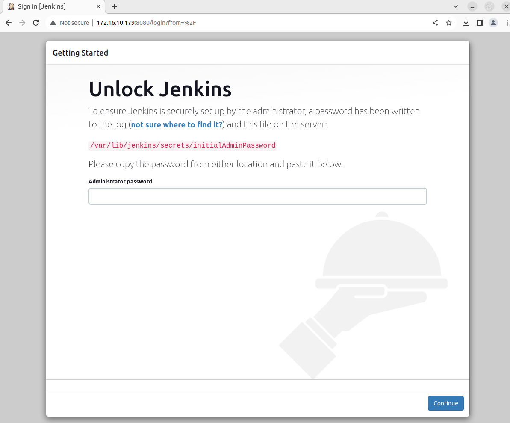
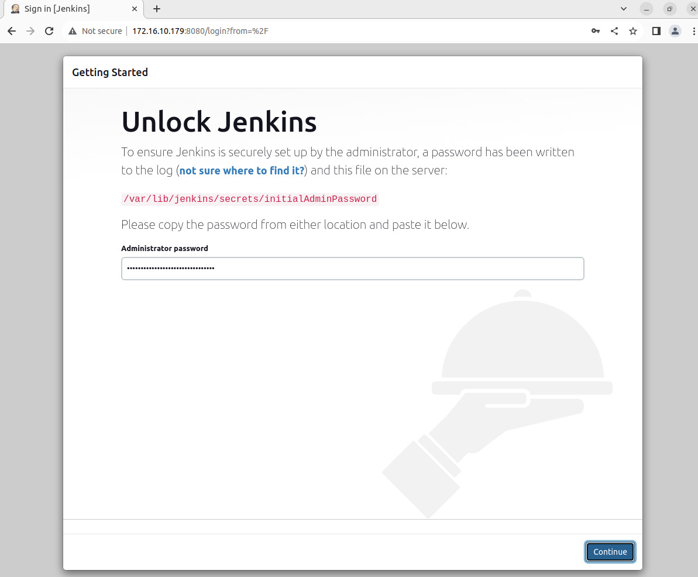
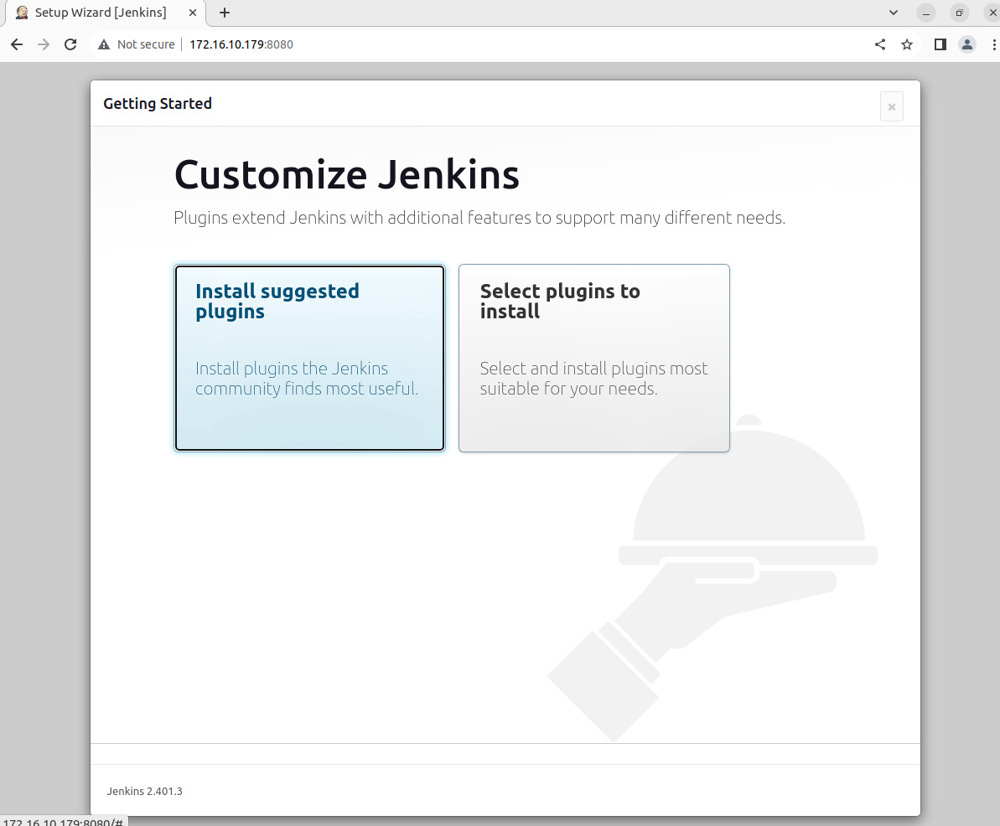
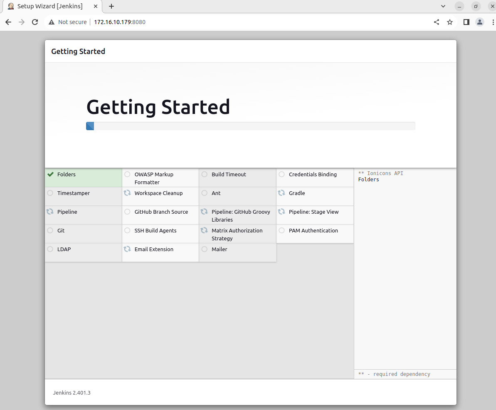
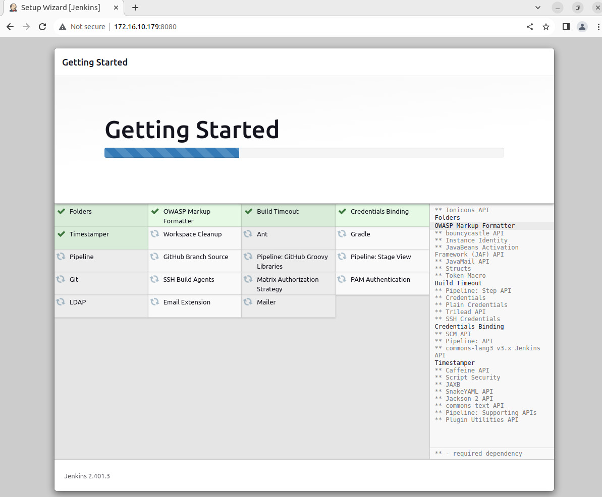
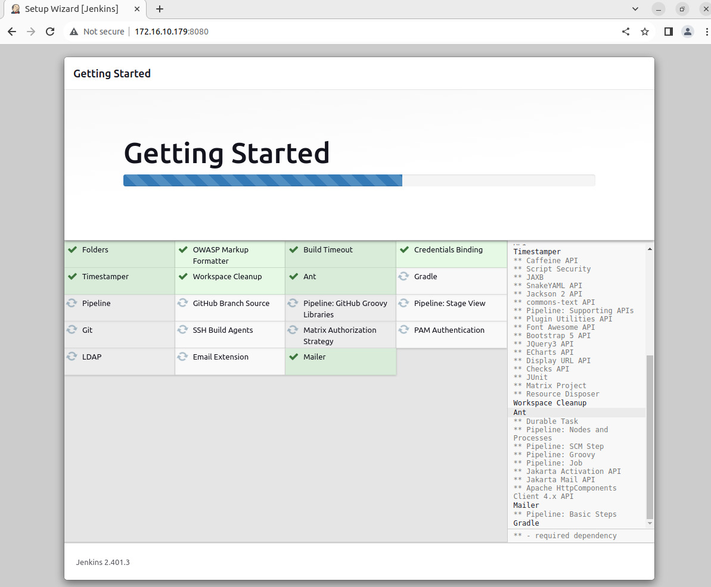
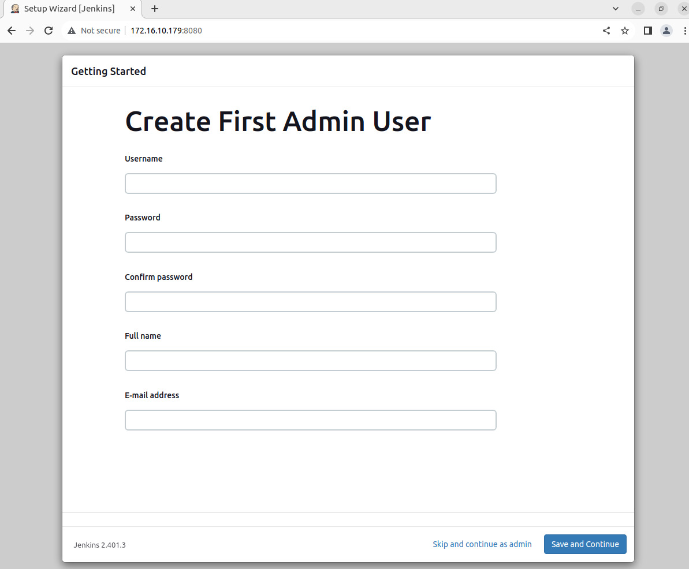
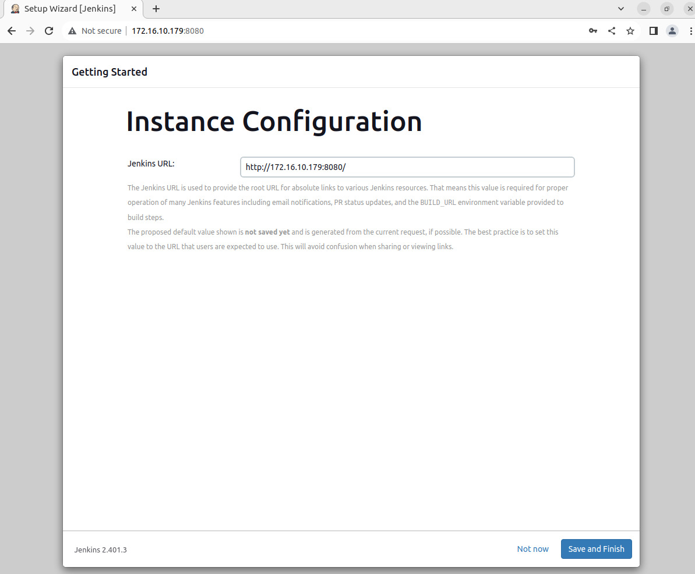
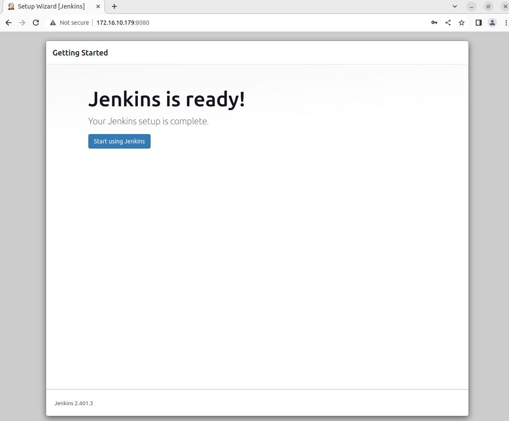
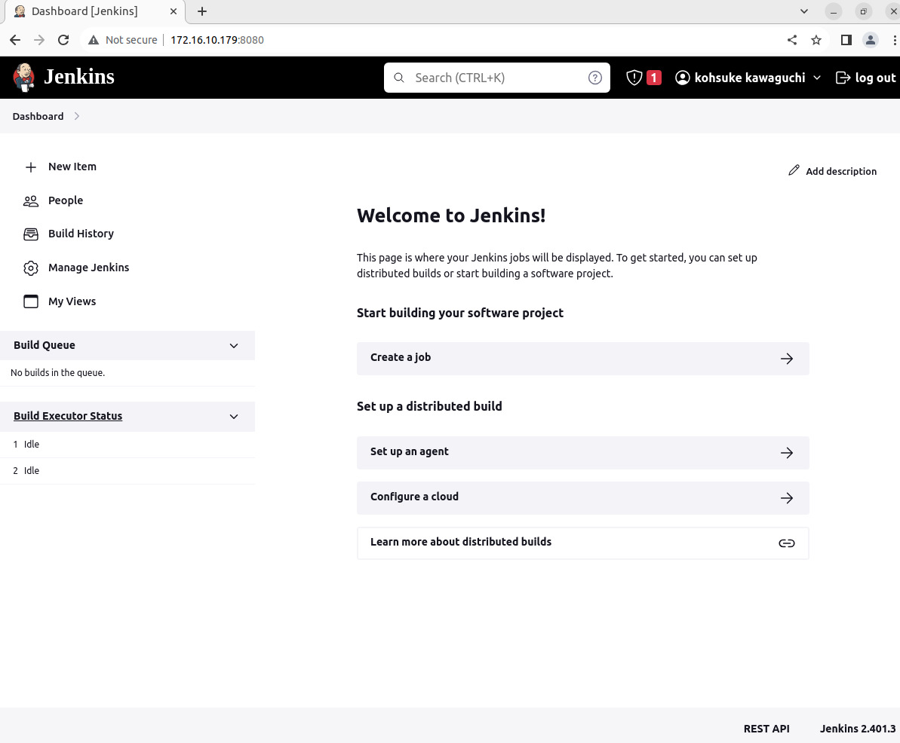

# Installing Jenkins


## Table of Contents

1. [Install Java](#install-java)

2. [Add Jenkins Repository](#add-jenkins-repository) 

3. [Install Jenkins](#install-jenkins)

4. [Modify Firewall to Allow Jenkins](#modify-firewall-to-allow-jenkins)

5. [Set up Jenkins](#set-up-jenkins)

6. [References](#references)


## Install Java

Jenkins requires the Java Runtime Environment (JRE). This guide uses OpenJDK for the Java environment.
OpenJDK is a Development Kit, and includes the Java Runtime Environment.

At the time of writing this article, Jenkins only supports Java 8 and Java 11 on Ubuntu. You can have multiple
versions of Java installed on Ubuntu. If you do, make sure Java 8 or Java 11 is set as the default version.

Follow the steps below to install Java on Ubuntu:

**1-1**. Check if you already have Java installed on your Ubuntu system:

```
java --version
```

```
admin@jenkins:~$ java --version
Command 'java' not found, but can be installed with:
sudo apt install openjdk-11-jre-headless  # version 11.0.20+8-1ubuntu1~22.04, or
sudo apt install default-jre              # version 2:1.11-72build2
sudo apt install openjdk-17-jre-headless  # version 17.0.8+7-1~22.04
sudo apt install openjdk-18-jre-headless  # version 18.0.2+9-2~22.04
sudo apt install openjdk-19-jre-headless  # version 19.0.2+7-0ubuntu3~22.04
sudo apt install openjdk-8-jre-headless   # version 8u382-ga-1~22.04.1
admin@jenkins:~$ 
```

**1-2**. Update the system package repository by running:


```
sudo apt update
```


**1-3**. Depending on which Java version you want to install, Java 8 or 11, run one of the following commands:

* To install OpenJDK 8, run:

```
sudo apt install openjdk-8-jdk -y
```

* To install OpenJDK 11, run:

```
sudo apt install openjdk-11-jdk -y
```

We install OpenJDK version 11 on our system.


```
admin@jenkins:~$ java --version
openjdk 11.0.20 2023-07-18
OpenJDK Runtime Environment (build 11.0.20+8-post-Ubuntu-1ubuntu122.04)
OpenJDK 64-Bit Server VM (build 11.0.20+8-post-Ubuntu-1ubuntu122.04, mixed mode, sharing)
admin@jenkins:~$ 
```

## Add Jenkins Repository

It is recommended to install Jenkins using the project-maintained repository, rather than from the default Ubuntu repository.
The reason for that is because the Jenkins version in the default Ubuntu repository might not be the latest available version,
which means it could lack the latest features and bug fixes.

Follow the steps below to add the Jenkins repository to your Ubuntu system.

**2-1**. Start by importing the GPG key. The GPG key verifies package integrity but there is no output. Run:

```
sudo curl -fsSL https://pkg.jenkins.io/debian-stable/jenkins.io.key \
| sudo tee /usr/share/keyrings/jenkins-keyring.asc > /dev/null
```

We encountered this error:

```
admin@jenkins:~$ sudo curl -fsSL https://pkg.jenkins.io/debian-stable/jenkins.io.key \
| sudo tee /usr/share/keyrings/jenkins-keyring.asc > /dev/null
curl: (28) SSL connection timeout
admin@jenkins:~$ 
```

To resolve it, we added the [shecan](https://shecan.ir/)'s IP in the `/etc/resolv.conf` :

```
admin@jenkins:~$ cat -n /etc/resolv.conf 
     1	# This is /run/systemd/resolve/stub-resolv.conf managed by man:systemd-resolved(8).
     2	# Do not edit.
     3	#
     4	# This file might be symlinked as /etc/resolv.conf. If you're looking at
     5	# /etc/resolv.conf and seeing this text, you have followed the symlink.
     6	#
     7	# This is a dynamic resolv.conf file for connecting local clients to the
     8	# internal DNS stub resolver of systemd-resolved. This file lists all
     9	# configured search domains.
    10	#
    11	# Run "resolvectl status" to see details about the uplink DNS servers
    12	# currently in use.
    13	#
    14	# Third party programs should typically not access this file directly, but only
    15	# through the symlink at /etc/resolv.conf. To manage man:resolv.conf(5) in a
    16	# different way, replace this symlink by a static file or a different symlink.
    17	#
    18	# See man:systemd-resolved.service(8) for details about the supported modes of
    19	# operation for /etc/resolv.conf.
    20	
    21	nameserver 127.0.0.53
    22	options edns0 trust-ad
    23	search Son.ir
admin@jenkins:~$ 

admin@jenkins:~$ sudo sed -i '23a \\nnameserver 178.22.122.100' /etc/resolv.conf 

admin@jenkins:~$ sudo sed -i '21s/^/#/' /etc/resolv.conf 

admin@jenkins:~$ tail -5 /etc/resolv.conf 
#nameserver 127.0.0.53
options edns0 trust-ad
search Son.ir

nameserver 178.22.122.100
admin@jenkins:~$ 
```

Run the previous command to importing the GPG key again: 

```
admin@jenkins:~$ sudo curl -fsSL https://pkg.jenkins.io/debian-stable/jenkins.io.key \
| sudo tee /usr/share/keyrings/jenkins-keyring.asc > /dev/null
[sudo] password for admin: 
admin@jenkins:~$
admin@jenkins:~$
admin@jenkins:~$ ls -lh /usr/share/keyrings
total 56K
-rw-r--r-- 1 root root 3.1K Aug  8 10:16 *jenkins-keyring.asc*
-rw-r--r-- 1 root root 2.2K Nov 10  2021 ubuntu-advantage-cc-eal.gpg
-rw-r--r-- 1 root root 2.3K Jul 16  2021 ubuntu-advantage-cis.gpg
-rw-r--r-- 1 root root 2.2K Jul 13  2021 ubuntu-advantage-esm-apps.gpg
-rw-r--r-- 1 root root 2.3K Jul 13  2021 ubuntu-advantage-esm-infra-trusty.gpg
-rw-r--r-- 1 root root 2.3K Jul 16  2021 ubuntu-advantage-fips.gpg
-rw-r--r-- 1 root root 2.2K Apr 21  2022 ubuntu-advantage-realtime-kernel.gpg
-rw-r--r-- 1 root root 2.2K Oct  5  2021 ubuntu-advantage-ros.gpg
-rw-r--r-- 1 root root 7.3K Sep 17  2018 ubuntu-archive-keyring.gpg
-rw-r--r-- 1 root root 6.6K Oct 27  2016 ubuntu-archive-removed-keys.gpg
-rw-r--r-- 1 root root 3.0K Mar 26  2021 ubuntu-cloudimage-keyring.gpg
-rw-r--r-- 1 root root    0 Jan 17  2018 ubuntu-cloudimage-removed-keys.gpg
-rw-r--r-- 1 root root 1.2K May 27  2010 ubuntu-master-keyring.gpg
admin@jenkins:~$ 
```

**2-2**. Add the Jenkins software repository to the source list and provide the authentication key:

```
sudo echo deb [signed-by=/usr/share/keyrings/jenkins-keyring.asc] https://pkg.jenkins.io/debian-stable binary/ \
> | sudo tee /etc/apt/sources.list.d/jenkins.list > /dev/null
```

Check the repository:

```
admin@jenkins:~$ ls -lh /etc/apt/sources.list.d
total 4.0K
-rw-r--r-- 1 root root 101 Aug  8 10:22 jenkins.list
admin@jenkins:~$ 
admin@jenkins:~$ 
admin@jenkins:~$ cat /etc/apt/sources.list.d/jenkins.list 
deb [signed-by=/usr/share/keyrings/jenkins-keyring.asc] https://pkg.jenkins.io/debian-stable binary/
admin@jenkins:~$ 
```

## Install Jenkins

After setting up the prerequisites, follow the steps below to install Jenkins on Ubuntu:

**3-1**. Update the system repository one more time. Updating refreshes the cache and makes the system 
aware of the new Jenkins repository.

```
sudo apt update
```

We encountered another error:

```
admin@jenkins:~$ sudo apt update
Hit:2 http://ir.archive.ubuntu.com/ubuntu jammy InRelease
Hit:3 http://ir.archive.ubuntu.com/ubuntu jammy-updates InRelease    
Hit:4 http://ir.archive.ubuntu.com/ubuntu jammy-backports InRelease  
Ign:1 https://pkg.jenkins.io/debian-stable binary/ InRelease        
Hit:5 http://ir.archive.ubuntu.com/ubuntu jammy-security InRelease  
Get:6 https://pkg.jenkins.io/debian-stable binary/ Release [2,044 B]
Get:7 https://pkg.jenkins.io/debian-stable binary/ Release.gpg [833 B]
Ign:7 https://pkg.jenkins.io/debian-stable binary/ Release.gpg
Reading package lists... Done
W: GPG error: https://pkg.jenkins.io/debian-stable binary/ Release: The following signatures couldn't be 
verified because the public key is not available: NO_PUBKEY 5BA31D57EF5975CA
E: The repository 'http://pkg.jenkins.io/debian-stable binary/ Release' is not signed.
N: Updating from such a repository can't be done securely, and is therefore disabled by default.
N: See apt-secure(8) manpage for repository creation and user configuration details.
admin@jenkins:~$  
```

Beginning March 28, 2023, the Jenkins weekly releases will use new repository signing keys for the Linux installation packages.
The same change will be made in Jenkins LTS releases beginning April 5, 2023. Administrators of Linux systems must install the
new signing keys on their Linux servers before installing Jenkins (Please refer to [References-03](https://www.jenkins.io/blog/2023/03/27/repository-signing-keys-changing/)).

```
admin@jenkins:~$ 
client@jenkins:~$ curl -fsSL https://pkg.jenkins.io/debian-stable/jenkins.io-2023.key \
| sudo tee > /usr/share/keyrings/jenkins-keyring.asc > /dev/null
admin@jenkins:~$ 
```

Then, update the apt again:

```
admin@jenkins:~$ sudo apt update
Hit:1 http://ir.archive.ubuntu.com/ubuntu jammy InRelease
Hit:2 http://ir.archive.ubuntu.com/ubuntu jammy-updates InRelease   
Hit:3 http://ir.archive.ubuntu.com/ubuntu jammy-backports InRelease 
Hit:4 http://ir.archive.ubuntu.com/ubuntu jammy-security InRelease  
Ign:5 https://pkg.jenkins.io/debian-stable binary/ InRelease        
Get:6 https://pkg.jenkins.io/debian-stable binary/ Release [2,044 B]
Get:7 https://pkg.jenkins.io/debian-stable binary/ Release.gpg [833 B]
Get:8 https://pkg.jenkins.io/debian-stable binary/ Packages [25.3 kB]
Fetched 28.1 kB in 2s (15.9 kB/s)   
Reading package lists... Done
Building dependency tree... Done
Reading state information... Done
75 packages can be upgraded. Run 'apt list --upgradable' to see them.
admin@jenkins:~$ 
```


**3-2**. Install Jenkins by running:

```
sudo apt install jenkins -y
```

Wait for the download and installation to complete.


```
admin@jenkins:~$ sudo apt install jenkins
Reading package lists... Done
Building dependency tree... Done
Reading state information... Done
The following additional packages will be installed:
  net-tools
The following NEW packages will be installed:
  jenkins net-tools
0 upgraded, 2 newly installed, 0 to remove and 75 not upgraded.
Need to get 95.9 MB of archives.
After this operation, 99.3 MB of additional disk space will be used.
Do you want to continue? [Y/n] y
Get:1 http://ir.archive.ubuntu.com/ubuntu jammy/main amd64 net-tools amd64 1.60+git20181103.0eebece-1ubuntu5 [204 kB]
Get:2 https://pkg.jenkins.io/debian-stable binary/ jenkins 2.401.3 [95.7 MB]
Fetched 95.9 MB in 29s (3,296 kB/s)                                                                                                
Selecting previously unselected package net-tools.
(Reading database ... 76492 files and directories currently installed.)
Preparing to unpack .../net-tools_1.60+git20181103.0eebece-1ubuntu5_amd64.deb ...
Unpacking net-tools (1.60+git20181103.0eebece-1ubuntu5) ...
Selecting previously unselected package jenkins.
Preparing to unpack .../jenkins_2.401.3_all.deb ...
Unpacking jenkins (2.401.3) ...
Setting up net-tools (1.60+git20181103.0eebece-1ubuntu5) ...
Setting up jenkins (2.401.3) ...
Created symlink /etc/systemd/system/multi-user.target.wants/jenkins.service → /lib/systemd/system/jenkins.service.
Processing triggers for man-db (2.10.2-1) ...
Scanning processes...                                                                                                               
Scanning linux images...                                                                                                            

Running kernel seems to be up-to-date.

No services need to be restarted.

No containers need to be restarted.

No user sessions are running outdated binaries.

No VM guests are running outdated hypervisor (qemu) binaries on this host.
admin@jenkins:~$ 
```


**3-3**. To check if Jenkins is installed and running, run the following command:

```
sudo systemctl status jenkins
```

A bright green entry labelled active (running) should appear in the output, indicating that the service is running.

```
admin@jenkins:~$ systemctl status jenkins.service 
● jenkins.service - Jenkins Continuous Integration Server
     Loaded: loaded (/lib/systemd/system/jenkins.service; enabled; vendor preset: enabled)
     Active: active (running) since Tue 2023-08-08 10:44:01 UTC; 1min 22s ago
   Main PID: 6746 (java)
      Tasks: 36 (limit: 2219)
     Memory: 395.4M
        CPU: 51.155s
     CGroup: /system.slice/jenkins.service
             └─6746 /usr/bin/java -Djava.awt.headless=true -jar /usr/share/java/jenkins.war --webroot=/var/cache/jenkins/war --http>

Aug 08 10:43:11 jenkins jenkins[6746]: e0f540da7b88471189bedcc1fb08e397
Aug 08 10:43:11 jenkins jenkins[6746]: This may also be found at: /var/lib/jenkins/secrets/initialAdminPassword
Aug 08 10:43:11 jenkins jenkins[6746]: *************************************************************
Aug 08 10:43:11 jenkins jenkins[6746]: *************************************************************
Aug 08 10:43:11 jenkins jenkins[6746]: *************************************************************
Aug 08 10:44:01 jenkins jenkins[6746]: 2023-08-08 10:44:01.595+0000 [id=29]        INFO    jenkins.InitReactorRunner$1#onAttain>
Aug 08 10:44:01 jenkins jenkins[6746]: 2023-08-08 10:44:01.702+0000 [id=22]        INFO    hudson.lifecycle.Lifecycle#onReady: >
Aug 08 10:44:01 jenkins systemd[1]: Started Jenkins Continuous Integration Server.
Aug 08 10:44:05 jenkins jenkins[6746]: 2023-08-08 10:44:05.220+0000 [id=44]        INFO    h.m.DownloadService$Downloadable#loa>
Aug 08 10:44:05 jenkins jenkins[6746]: 2023-08-08 10:44:05.222+0000 [id=44]        INFO    hudson.util.Retrier#start: Performed>
admin@jenkins:~$ 
admin@jenkins:~$ 
admin@jenkins:~$ systemctl is-enabled jenkins.service 
enabled
admin@jenkins:~$
```

## Modify Firewall to Allow Jenkins

Allow Jenkins to communicate by setting up the default UFW firewall.

**4-1**. Open port 8080 by running the following commands:

```
sudo ufw allow 8080
```

```
sudo ufw status
```

If you're using a different firewall application, follow its specific instructions to allow traffic on port 8080.


**4-2**. If you haven't configured the UFW firewall yet, it displays as inactive. Enable UFW by running:

```
sudo ufw enable
```


## Set up Jenkins

Follow the steps below to set up Jenkins and start using it:

**5-1**. Open a web browser, and navigate to your server's IP address. Use the following syntax:

```
http://ip_address_or_domain:8080
```

Use the actual IP address or domain name for the server you're using Jenkins on. For example,
if you're running Jenkins locally, use localhost (127.0.0.1):

```
http://localhost:8080
```





A page opens prompting you to **Unlock Jenkins**. Obtain the required administrator password in the next step.


**5-2**. Obtain the default Jenkins unlock password by opening the terminal and running the following command:


```
admin@jenkins:~$ sudo ls -lh /var/lib/jenkins/secrets
total 12K
-rw-r----- 1 jenkins jenkins  33 Aug  8 10:43 initialAdminPassword
-rw-r--r-- 1 jenkins jenkins  32 Aug  8 10:43 jenkins.model.Jenkins.crumbSalt
-rw-r--r-- 1 jenkins jenkins 256 Aug  8 10:43 master.key


admin@jenkins:~$ sudo cat /var/lib/jenkins/secrets/initialAdminPassword
e0f540da7b88471189bedcc1fb08e397
```

The system returns an alphanumeric code. Enter that code in the _Administrator password_ field and click **Continue**.





**5-3**. The setup prompts to either **Install suggested plugins** or **Select plugins to install**. It’s fine to simply 
install the suggested plugins.





You can always install more plugins later. The system continues the initial Jenkins setup.











**5-4**. The next step is the **Create First Admin User**. Enter the credentials you want to use for your Jenkins administrator,
then click **Save and Continue**.





**5-5**. After this, you should set up the **Instance Configuration**. This is the preferred network address for this
Jenkins installation. Confirm the address you want to use for your server. This is most likely the same address you
used to get to this configuration page.





Once you specify the Jenkins URL, click **Save and Finish**.


**5-6**. You should see a page that says **Jenkins is ready**! Click **Start using Jenkins** to open the Jenkins dashboard.








## References

01. [Installing Jenkins](https://www.jenkins.io/doc/book/installing/)

02. [Installing Jenkins > Linux](https://www.jenkins.io/doc/book/installing/linux/)

03. [Installing Jenkins > Linux > Ubuntu](https://www.jenkins.io/doc/book/installing/linux/#debianubuntu)

04. [How to Install Jenkins on Ubuntu 22.04 - Phoenixnap](https://phoenixnap.com/kb/install-jenkins-ubuntu)

05. [How To Install Jenkins on Ubuntu 22.04 - Digitalocean](https://www.digitalocean.com/community/tutorials/how-to-install-jenkins-on-ubuntu-22-04)

06. [Jenkins 2.397 and 2.387.2: New Linux Repository Signing Keys](https://www.jenkins.io/blog/2023/03/27/repository-signing-keys-changing/)

